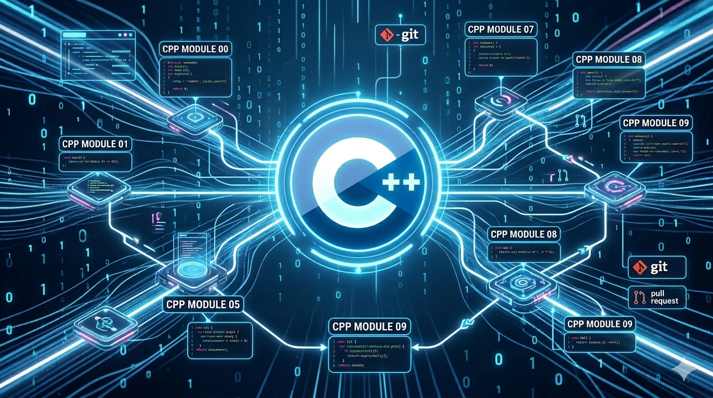

# C++ Modules — 42 | akoaik



A 10-module journey through C++ from the ground up — written entirely in C++98.
Each module builds on the last, introducing one major concept at a time.

---

## 🗺️ The Learning Path

```
CPP00 → CPP01 → CPP02 → CPP03 → CPP04 → CPP05 → CPP06 → CPP07 → CPP08 → CPP09
 OOP     Memory   OCF    Inherit  Poly   Exceptions Casts  Templates  STL   STL Applied
```

---

## CPP00 — First Steps into OOP

**The question:** How do you go from C to C++?

The first time writing actual C++ — classes, member functions, `std::string`, `std::cin/cout`. Nothing fancy, just learning to think in objects.

- Built a `megaphone` program (uppercase args) — getting familiar with `std::` and basic I/O
- Built a `PhoneBook` — my first real class with private data, public methods, and a loop-driven menu

**💡 What I learned:** How classes work, what `private`/`public` mean in practice, and why `std::string` is better than `char *`.

---

## CPP01 — Memory, Pointers, and References

**The question:** Where does an object live, and how do you point to it?

This module forced me to understand the difference between stack and heap allocation, and when to use a reference vs a pointer.

- `Zombie` on the heap (`new`/`delete`) vs on the stack — and why it matters for lifetime
- `ZombieHorde` — allocating an array of objects with `new[]`
- `HumanA` holds a `Weapon&` (always has one), `HumanB` holds a `Weapon*` (might not) — the clearest possible lesson on references vs pointers
- `Harl` — using **pointers to member functions** to dispatch log levels, avoiding a big if/else chain

**💡 What I learned:** Stack vs heap, `new`/`delete`, references vs pointers, and that member function pointers exist.

---

## CPP02 — Operator Overloading and Orthodox Canonical Form

**The question:** How do you make a class behave like a built-in type?

Built a fixed-point number class from scratch across three exercises, adding more operators each time.

- **OCF** — every class needs: default constructor, copy constructor, copy assignment operator, destructor
- Overloaded `+`, `-`, `*`, `/`, `<<`, and all comparison operators
- Learned that when you write `a = b`, C++ calls `operator=` — and if you don't define it, it does a shallow copy

**💡 What I learned:** The Orthodox Canonical Form, how operator overloading works, and fixed-point arithmetic as a real-world use case.

---

## CPP03 — Inheritance

**The question:** How does one class build on another?

Constructed a chain of robot classes: `ClapTrap` → `ScavTrap` → `FragTrap`. Each child inherits attributes and can override or add behavior.

- Constructor/destructor chaining — watching the order they fire
- Calling parent methods with `ClapTrap::attack()`
- Hit points, energy points, and attack damage pass down through the hierarchy

**💡 What I learned:** How inheritance works in C++, constructor/destructor order, access specifiers in a hierarchy, and what `protected` is actually for.

---

## CPP04 — Polymorphism and Abstract Classes

**The question:** How do you treat different objects the same way through a common interface?

The biggest conceptual leap so far. Added `virtual` to functions and suddenly a pointer to `Animal` could call `Dog`'s sound.

- `virtual` keyword — enables runtime dispatch (vtable)
- `Animal* a = new Dog()` — the pointer type is `Animal`, but the right `makeSound()` gets called
- `Brain` class — forced deep copy, understanding why shallow copy breaks when members are pointers
- Pure virtual functions (`= 0`) — making `Animal` abstract so you can't instantiate it directly

**💡 What I learned:** Virtual functions, vtables, polymorphism, abstract classes, interfaces, and why deep copy matters when your class owns heap memory.

---

## CPP05 — Exceptions

**The question:** How do you handle errors without returning error codes everywhere?

Built a bureaucracy simulator where `Bureaucrat` objects sign `Form` objects — and everything can fail.

- `throw`, `try`, `catch` — the C++ exception mechanism
- Custom exception classes inheriting from `std::exception`
- `AForm` as an abstract base class — concrete forms (`ShrubberyCreationForm`, `RobotomyRequestForm`, `PresidentialPardonForm`) implement the execution logic
- `Intern` creates forms by name — my first use of the **Factory pattern**

**💡 What I learned:** Exception handling, writing custom exception types, abstract base classes in a real hierarchy, and the Factory design pattern.

---

## CPP06 — Type Casting

**The question:** How do C++ casts actually work — and when do you use which one?

Three exercises, each targeting a different cast operator.

- `static_cast` — scalar type conversion (int → float → char), with edge cases like `nan` and `inf`
- `reinterpret_cast` — treating a pointer as a raw integer (serialization) and back
- `dynamic_cast` — identifying the real runtime type of a polymorphic object

**💡 What I learned:** C++ has 4 cast operators for a reason. Each one communicates intent and catches different mistakes at compile or runtime. Never use C-style casts in C++.

---

## CPP07 — Templates

**The question:** How do you write code that works for any type?

First contact with C++ templates — generic functions and classes that the compiler specializes per type.

- `swap`, `min`, `max` as function templates — work on any comparable type
- `iter` — a generic function that applies any function to every element of any array
- `Array<T>` — a generic class with bounds-checked `operator[]` that throws on out-of-range access

**💡 What I learned:** How function and class templates work, template instantiation, why template code lives in `.hpp` files, and how to write generic but type-safe code.

---

## CPP08 — STL Containers and Iterators

**The question:** How does the Standard Template Library actually work?

Moved from writing generic code to using the STL properly — containers, iterators, algorithms.

- `easyfind` — a template function using `std::find` to search any integer container; throws if not found
- `Span` — a class storing up to N integers with `shortestSpan()` and `longestSpan()` using `std::min_element` / `std::max_element`
- `MutantStack` — extended `std::stack` to expose iterators (stack normally hides them)

**💡 What I learned:** How STL containers and iterators work under the hood, how to use `<algorithm>`, and how to extend existing STL classes.

---

## CPP09 — STL Applied to Real Problems 🏆

**The question:** Can you choose the right container for the job?

The hardest module — three independent problems, each requiring a different STL container and algorithm.

- **Bitcoin Exchange** — parse a CSV price database, evaluate a list of inputs, output BTC values. Uses `std::map` for O(log n) date lookups with `lower_bound`
- **Reverse Polish Notation** — evaluate RPN expressions (`3 5 8 * 7 - +`). Uses `std::stack` naturally
- **PmergeMe** — sort a sequence using the **Ford-Johnson algorithm** (merge-insertion sort), which minimizes comparisons. Implemented with both `std::vector` and `std::deque`, using Jacobsthal-ordered insertion and bounded binary search

**💡 What I learned:** How to pick the right container (`map`, `stack`, `vector`, `deque`), how iterators differ between containers, and what algorithmic complexity looks like in practice. Ford-Johnson was the most complex algorithm I implemented.

---

## Overall Takeaways

| 📌 Concept | 💡 Where it clicked |
|---|---|
| Classes and OOP | CPP00 |
| Memory management | CPP01 |
| Operator overloading | CPP02 |
| Inheritance | CPP03 |
| Polymorphism | CPP04 |
| Exception handling | CPP05 |
| Type system and casts | CPP06 |
| Generic programming | CPP07 |
| STL internals | CPP08 |
| Algorithm design | CPP09 |

Going through these modules, C++ stopped feeling like "C with classes" and started making sense as a language with a consistent design philosophy — one where you control everything, and the type system helps you do it safely.

---

*42 Network — C++ Modules | C++98*
